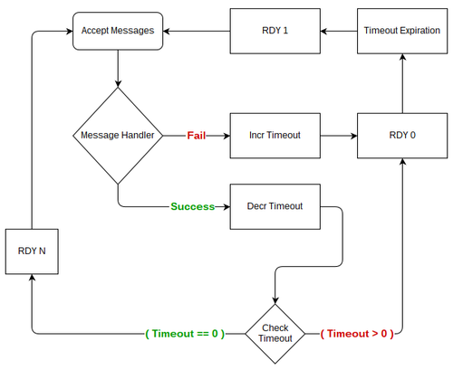

# 编译客户端库

NSQ 将一些功能集成到客户端库中，以便维持集群的健壮性和性能。

这篇文章试图列出客户端库通常需要完成的功能。因为发布到 `nsqd` 非常的琐碎（仅用 HTTP POST  `/put` 节点就可），这个文档主要关注消费者。

通过规范，我们希望各种语言实现的时候都能保持一致性。

### 概要

 1. [配置](#configuration)
 2. [发现](#discovery) (optional)
 3. [连接处理](#connection_handling)
 4. [特性协商](#feature_negotiation)
 5. [数据流/ Heartbeats](#data_flow)
 6. [消息处理](#message_handling)
 7. [RDY 状态](#rdy_state)
 8. [Backoff](#backoff)
 9. [加密/压缩](#encryptioncompression)

## <a name="configuration">配置</a>

从高层看，配置相关的设计理念是希望系统能支持不同的工作负载，使用相同的默认值能立即可用，并且能讲拨号数最小化。

消费者通过 TCP 连接到 `nsqd` 实例，订阅`通道（channel)` 上的 `话题（topic)`。每个连接只能订阅一个话题（topic)，因此消费多个话题（topic)，必须响应的结构化。

使用 `nsqlookupd` 来发现是方案之一，所以客户端库必须支持消费者直接连接一个或多个 `nsqd` 实例，或者它可用轮询一个或多个 `nsqlookupd` 实例。当消费者轮询 `nsqlookupd` 的时候，时间间隔必须是可配置的。另外，因为 NSQ 的标准部署是分布式环境，包含很多消费者和生产者，客户端库必须根据配置值得随机性自动添加抖动。更多细节参考[发现](#discovery).

对于消费者来说，在 `nsqd` 	响应前能接收到多少消息是非常重要的指标。这个管道促进缓存，批处理，异步消息处理。这个值称为 `max_in_flight` ,并且它影响了 `RDY` 状态。更多细节参见  [RDY 状态](#rdy_state)。

设计系统时通常会考虑优雅处理失败，客户端库希望能实现失败消息的重试，并提供边界参数来处理每个消息尝试次数。更多细节参见[消息处理](#message_handling)。

当消息处理失败的时候，客户端库能自动将消息重新队列。 NSQ 支持使用 `REQ` 命令发送延迟。客户端库需要能提供延迟的初始化值（第一次失败时），以及重新队列失败该如何改变。更多细节参见 [Backoff](#backoff).

最重要的时，客户端库必须支持消息处理的回调函数配置。这些回调函数必须简单，通常都支持一个参数（消息对象的实例）。

## <a name="discovery">发现</a>

`nsqlookupd` 是 NSQ 的重要组成部分，它为消费者发现服务提供来定位 `nsqd` ，它在运行时提供一个指定话题（topic)。

虽然使用 `nsqlookupd` 能大幅减少配置数目，但是需要维持并放大一个巨大的分布式 NSQ 集群。

当消费者使用 `nsqlookupd` 来发现时，客户端库 必须管理轮询所有 `nsqlookupd` 实例的进程，最新的 `nsqd` 组合以问题形式提供了话题（topic)，并且管理到这些 `nsqd` 的连接。

查询一个 `nsqlookupd` 实例非常的简单。执行一个 HTTP 请求，使用消费者试图发现的话题（topic) 作为查询参数来查找节点（例如`/lookup?topic=clicks`). 响应体是 JSON:


{
    "status_code": 200,
    "status_txt": "OK",
    "data": {
        "channels": ["archive", "science", "metrics"],
        "producers": [
            {
                "broadcast_address": "clicksapi01.routable.domain.net",
                "hostname": "clicksapi01.domain.net",
                "tcp_port": 4150,
                "http_port": 4151,
                "version": "0.2.18"
            },
            {
                "broadcast_address": "clicksapi02.routable.domain.net",
                "hostname": "clicksapi02.domain.net",
                "tcp_port": 4150,
                "http_port": 4151,
                "version": "0.2.18"
            }
        ]
    }
}


`broadcast_address` 和 `tcp_port` 必须用来连接 `nsqd`。 因为从设计上来说 `nsqlookupd` 实例不会分享或协调他们的数据，客户端库必须联合它接收到得所有 `nsqlookupd` 查询列表来建立 `nsqd` 最终列表。使用 `broadcast_address:tcp_port` 作为这个联合的唯一 KEY。

必须用周期性的计时器来重复的轮询 `nsqlookupd` 的配置，这样消费者能自动的发现新的 `nsqd`。客户端库必须自动的初始化到所有新发现的实例的连接。

当客户端库开始执行的时候，它必须通过踢开配置 `nsqlookupd` 实例的一组请求，来引导轮询。

## <a name="connection_handling">连接处理</a>

一旦消费者有一个 `nsqd` 可以连接(通过发现或手工配置), 它就必须打开一个 TCP 连接到 `broadcast_address:port`。一个单独的 TCP 连接必须能让消费者可以订阅到每个 `nsqd` 的 话题（topic)。

当连接到一个 `nsqd` 实例时，客户端库必须发送以下数据，顺序是：

 1. 魔术标识符
 2. 一个 `IDENTIFY` 命令 (和负载) 和读/验证响应 (参见 [特性协商](#feature_negotiation))
 3. 一个 `SUB` 命令 (指定需要的话题（topic)) 和读/验证响应
 4. 一个初始化 `RDY` 值 1 (参见 [RDY 状态](#rdy_state)).

(低级别的细节参见[spec][protocol_spec])

### 重新连接

客户端库必须通过以下方法自动重新连接：

 * 如果消费者通过特定的 `nsqd` 列表指定，重新连接必须通过延迟重试来处理。（列如，8s, 16s, 32s, 等等., 到最大值后重试）。

 * 如果消费者通过 `nsqlookupd` 来发现实例，必须通过轮询间隔来自动处理重新连接（例如，如果消费者断开和 `nsqd` 的连接，客户端库仅在随后的 `nsqlookupd` 轮询发现的实例后重新连接）。这能保证消费者了解 `nsqd`。

## <a name="feature_negotiation">特性协商</a>

`IDENTIFY` 命令可以用来设置 `nsqd` 端的元数据, 修改客户端设置，并特性协商，它满足亮点：

 1. 某些情况下，客户端可能会修改 `nsqd` 的交互方式（比如，修改客户端的心跳间隔，并允许压缩, TLS, 输出缓存, 等等. -
    完整列表参见 [spec][protocol_spec])
 2. `nsqd` 使用 JSON payload 来响应 `IDENTIFY` 命令，它包含了重要的服务端配置值，客户端和之交互时必须遵守。

连接后，根据用户的配置, 客户端库必须发送一个 `IDENTIFY`命令,  它的内容是 JSON payload:


{
    "client_id": "metrics_increment",
    "hostname": "app01.bitly.net",
    "heartbeat_interval": 30000,
    "feature_negotiation": true
}


`feature_negotiation` 位表示客户端可以接受返回值是 JSON payload。
`client_id` 和 `hostname` 是随意的文本字段， `nsqd` (和 `nsqadmin`)会用来区别客户端. `heartbeat_interval` 配置每个客户端的心跳间隔。

`nsqd` 必须响应 `OK`，如果它不支持特性协商 (`nsqd``v0.2.20+`引入), 否则:


{
    "max_rdy_count": 2500,
    "version": "0.2.20-alpha"
}


更多 `max_rdy_count` 的使用细节参见 [RDY 状态](#rdy_state) 章节。

## <a name="data_flow">数据流和心跳</a>

一旦消费者处于订阅状态， NSQ 协议里的数据流时异步的。对于消费者来说,这就是说如果想建立一个健壮并高效的客户端库，就必须使用异步的网络 IO 循环和/或“线程”（线程表示 OS 级别的线程和用户空间（userland）的进程，比如协同程序（coroutines））。

另外， 期望客户端能响应它们连接到的 `nsqd` 实例的周期性心跳。通常这个周期是 30 秒。客户端可以使用任何命令响应，不过通常方便起见，使用 `NOP` 响应心跳。更多细节参见 [protocol spec][protocol_spec]。

“进程”必须专注于读取 TCP socket 的数据，解包帧数据，并执行多路逻辑来传输。这也是处理心跳最佳点。从最低级别看，读取协议包括以下步骤：

 1. 读取 4 字节 big endian uint32 大小
 2. 读取 size bytes data
 3. 解包数据
 4. ...
 5. profit
 6. goto 1

### 一个和错误相关小插曲

根据系统的异步特性，会采用更多的状态来追踪相关协议的由命令产生的错误。我们会采用“快速错误”（"fail fast"）方法，所以大量协议级别错误处理都是致命的。这意味着如果客户端发送一个无效命令（或者自己是无效状态），通过强制关闭连接（如果可能，发送一个错误给客户端），它连接到的 `nsqd` 实例将会保护自己（和系统）。和之前提到的连接处理相配合，使得系统更加健壮和稳定。

仅有的几个非致命错误是:

 * `E_FIN_FAILED` - `FIN` 命令, 无效的消息 ID
 * `E_REQ_FAILED` - `REQ` 命令 无效的消息 ID
 * `E_TOUCH_FAILED` - `TOUCH` 命令 无效的消息 ID

因为这些错误通常和时间有关，所以不当做致命错误。这些错误通常发生在 `nsqd` 端消息超时，重新队列时，和投递到其他消费者时。原先的接受者不再允许响应这个消息。

## <a name="message_handling">消息处理</a>

当 IO 循环解包包含消息的帧数据时，它必须路由这个消息给配置处理函数来处理。

发送 `nsqd`，在配置消息超时时希望收到回复（默认：60秒）。可能有以下场景：

 1. 处理函数表示消息已经成功处理
 2. 处理函数表示消息正处理成功
 3. 处理函数表示需要更多的时间来处理消息
 4. in-flight 超时，并且 `nsqd` 自动重新队列消息

前 3 个情况，客户端库必须发送合适消费者方面的命令 (`FIN`, `REQ`, 和 `TOUCH`).

`FIN` 命令最简单。它告诉 `nsqd` 它能安全的抛弃消息。`FIN` 也能抛弃那些你不想处理或重试的消息。

`REQ` 命令告诉 `nsqd`，消息必须重新队列（可选参数指定了重试的次数）。如果消费者没有指定可选参数，客户端库必须自动算出相关联的消息处理的时长（通常设置为多倍，这样效率更高）。客户端库必须抛弃超过最多重试次数的消息。当它发生的时候，必须执行用户提供的回调来通知，并运行特定的回调。

如果消息处理函数需要的时间超过配置的超时时间，可以用 `TOUCH` 命令来重置 `nsqd` 端的计时器。可以重复这个动作，直到消息 `FIN` 或 `REQ`，或发送 `nsqd` 的配置属性 `max_msg_timeout`。客户端库不能自动 `TOUCH` 代表消费者。

如果发送 `nsqd` 实例没有接收到响应，消息将会超时，并会自动重新队列来投递到可用的消费者。

最后，每个消息的属性是尝试次数。客户端库必须比较这个值和配置的最大值，并且抛弃已经超过这个值得消息。当消息已经抛弃的时候，需要触发回调。通常这个回调的实现必须包括写入磁盘，日志等等。用户必须能重写默认的处理函数。

## <a name="rdy_state">RDY 状态</a>

因为消息是从 `nsqd` 推送到消费者那，我们必须拥有一个方法来管理数据流，而不仅依赖于低级别的 TCP 语法。消费者的 `RDY` 状态是 NSQ 的流控制机制。

如 [配置 section](#configuration) 列出的内容，通过 `max_in_flight` 配置消费者。这是并行的并且性能 knob。比如一些下行流系统可以更加容易进行消息批处理，并对更高级的 `max-in-flight` 有利。

当消费者连接到`nsqd` (并且订阅) ，`RDY` 初始化状态为 `0`。
不会投递任何消息。

客户端库拥有很少的责任：

 1. 引导并最终分布配置 `max_in_flight` 到所有的连接。
 2. 永远不允许汇集所有连接 `RDY` 的和(`total_rdy_count`)，为超过 `max_in_flight` 的配置。
 3. 永远不要超过每个连接 `nsqd` 配置的 `max_rdy_count`。
 4. 暴露一个 API 方法给值得信赖的消息流。

### <a name="bootstrap_and_distribution">1. 引导和分布</a>

为连接选择 `RDY` 值，需要考虑的因素很少（最终分布为 `max_in_flight`):

 * 连接 # 是动态的，通常并不知道次数（例如，当通过 `nsqlookupd` 发现 `nsqd`)。
 * `max_in_flight` 可能会小于你的连接数

为了开始消息流，客户端库必须发送一个初始的 `RDY` 值。因为最终的连接数并不知道（通常从 '1' 开始），所以客户端库必能公平对待每个连接。

另外，每个消息处理后，客户端库必须评估什么时候更新 `RDY` 状态。如果当前值是 '0'，或者低于最后发送的值的 25% 必须触发更新。

客户端库必须一直尝试最终分布 `RDY` 值到所有的连接。
通常来说，它可以通过 `max_in_flight / num_conns` 实现。

然而，当  `max_in_flight < num_conns` 这个简单的公式无效的时候。客户端库必须执行一个动态的运行评估，自从通过之前的连接接收到得消息后，连接的 `nsqd` '活跃度'的时间。当配置到期后，他必须重新分布，不论 `RDY` 值是否对于新的 `nsqd` 有效。这么做，你能保证你可以通过消息找到 `nsqd`。清楚这些会有延迟的影响。

### 2. 维护 `max_in_flight`

客户端库必须维护指定消费者的消息 in flight 的最大值。尤其，汇集每个连接的 `RDY` 值永远不能超过配置的 `max_in_flight` 值。

底下的 Python 代码，它指出 RDY 值是否对于指定的连接有效。


def send_ready(reader, conn, count):
    if (reader.total_ready_count + count) > reader.max_in_flight:
        return

    conn.send_ready(count)
    conn.rdy_count = count
    reader.total_ready_count += count


### 3. `nsqd` 最大 RDY 值

每个 `nsqd` 通过 `--max-rdy-count` 配置（更多细节参见 [feature negotiation](#feature_negotiation) ），如果消费者发送的 `RDY` 值 超过了可接受的范围，它的连接将强制关闭。为了向后兼容，这个值必须假设为 `2500` ，如果 `nsqd` 实例不能支持[特性协商](#feature_negotiation)。

### 4. 消息流 Starvation

最终，客户端库必须提供一个 API 方法，来表示消息流 starvation。对于消费者（消费者处理函数）来说，简单比较 in-flight 的消息数和 `max_in_flight` 值，来决定是否”批处理“不太合适。有两种情况有问题：

 1. 当消费者配置 `max_in_flight > 1`, 根据变量 `num_conns`,`max_in_flight` 除 `num_conns` 除不尽。因为你永远不能超过`max_in_flight`, 你必须降低，并且在 `RDY` 值少于 `max_in_flight` 时结束。
 2. 如果仅仅 `nsqd` 的子集有消息，因为[even distribution](#bootstrap_and_distribution) 的 `RDY` 预期值, 这些活跃 `nsqd` 仅有 `max_in_flight` 的片段。

以上两种情况，消费者实际上永远不会接受消息的 `max_in_flight` #。因此，客户端库必须暴露一个方法 `is_starved`，表示任何连接是否 starved, 如下:


def is_starved(conns):
    for c in conns:
        # the constant 0.85 is designed to *anticipate* starvation rather than wait for it
        if c.in_flight > 0 and c.in_flight >= (c.last_ready * 0.85):
            return True
    return False


`is_starved` 方法必须由消息处理函数使用，来发现什么时候处理批量消息。

## <a name="backoff">Backoff</a>

消息处理失败的时候如何处理是一个非常复杂的问题。[消息处理](#message_handling) 章节介绍了客户端库动作，它会处理和时间相关的失败的消息。其他的问题是是否减少吞吐量。这两个功能对于整个系统的稳定性至关重要。

通过减慢处理的速率，或者 "backing off"， 消费者允许下游系统回收传输失败。然而这个行为必须是可配置的，因为不是什么时候都能称心如意，这种情况下延迟必须优先处理。

Backoff 必须通过发送 `RDY 0` 到合适的 `nsqd` 来实现，停止消息流。这个状态的时长通过重试的失败来计算。处理成功会减少这个时长，直到 reader 不再是 backoff 状态。

当 reader 是 backoff 状态时，超时后，客户端库必须仅发送过 `RDY 1` ，而不是 `max_in_flight`。 在返回完整的 throttle 前，这是有效的  "tests the waters"。另外，backoff 超时时，客户端库必须忽略任何和计算 backoff 时间成功或者失败结果。（比如，每次超时时它仅信任一个结果）

## 加密/压缩

NSQ 支持加密和/或压缩 特性协商，通过`IDENTIFY` 命令. TLS 用来加密. [Snappy][snappy] 和 DEFLATE 都支持压缩。 Snappy 可作为第三方库使用, 但是基本所有的语言都支持 DEFLATE。

收到 `IDENTIFY` 响应时，并且你通过 `tls_v1` 标志位 请求 TLS ，你得到的东西和以下内容类似：


{
    "deflate": false,
    "deflate_level": 0,
    "max_deflate_level": 6,
    "max_msg_timeout": 900000,
    "max_rdy_count": 2500,
    "msg_timeout": 60000,
    "sample_rate": 0,
    "snappy": true,
    "tls_v1": true,
    "version": "0.2.28"
}


确认 `tls_v1` 为 `true` 后（意味着服务器支持 TLS），在接受和发送任何消息前，你需要初始化 TLS 握手（例如，Python 使用 `ssl.wrap_socket` 表示完成）。TLS 握手成功后，你必须立即读取一个 NSQ 加密的  `OK` 响应。

如果你想压缩，可以设置 `snappy` 或 `deflate` 为 `true` ，并且使用合适压缩（解压缩）调用读写。同样的你必须立即读取一个 NSQ 压缩的  `OK` 响应。

这些压缩特性是互斥的。

你不能阻止缓存直到加密/压缩协商完成，或者确保小心的读取到内存。

## 汇总

分布式系统非常有意思。

不同的 NSQ 集群部门间交互在一个平台上，它健壮，高性能，并且稳定。希望您能这篇文章里了解到客户端是多么重要。

这些细节的实现，我们将 [pynsq][pynsq] 和 [go-nsq][go-nsq] 作为代码基础。[pynsq][pynsq] 可以切割为 2 个部分：

 * `Message` - 高级别的消息对象, 它暴露了状态方法，来响应`nsqd`(`FIN`, `REQ`, `TOUCH`, 等等.)，同时元数据包含目的和时间戳。

 * `Connection` - 高级别的封装，包含 TCP 连接到一个指定的 `nsqd`, 它包含 flight  消息，`RDY` 状态，协商特性，和不同时间。

 * `消费者` - 和用户打交道的 API，它处理发现，创建连接（和订阅），引导和管理 `RDY` 状态，解析收到的数据，创建消息对象，和分发消息给处理函数。

 * `Producer` -和用户打交道的 API，处理发布。

我们很高兴能帮助任何对编写客户端库有兴趣的人。我们希望大家能加入到社区，扩展目前已经存在的库。社区已经开源[很多客户端
库][clinet_libraries]。

[go-nsq]: https://github.com/bitly/go-nsq
[pynsq]: https://github.com/bitly/pynsq
[clinet_libraries]:./clinet_libraries.md
[snappy]: https://code.google.com/p/snappy/
[protocol_spec]:./tcp_protocol_spec.md
