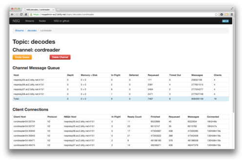
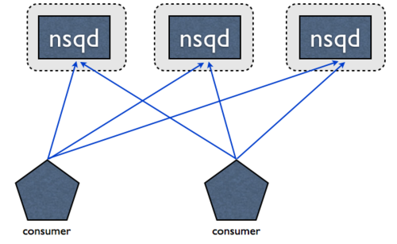
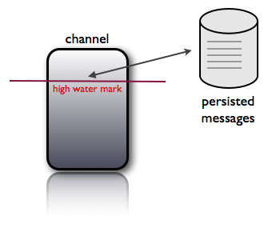
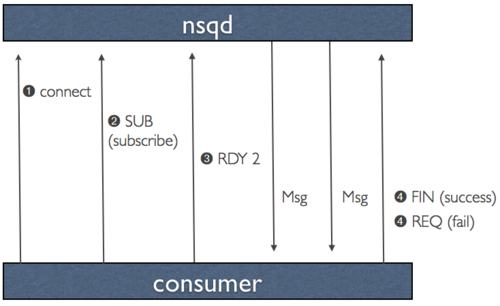

# 设计

注意：可视化的演示参见 [slide deck][slides]。

**NSQ** 是继承于 [simplequeue][simplequeue](部分的 [simplequeue][simplequeue])，因此被设计为（排名不分先后）

 * 提供更简单的拓扑方案，达到高可性和消除单点故障
 * 满足更强的消息可靠传递的保证
 * 限制单个进程的内存占用（通过持久化一些消息到硬盘上）
 * 极大简化了生产者和消费者的配置要求
 * 提供了一个简单的升级路径
 * 提升效率

## 简化配置和管理

单个 `nsqd` 实例被设计成可以同时处理多个数据流。流被称为“话题(topic)”和话题(topic)有 1 个或多个“通道（channel）”。每个通道（channel）都接收到一个话题(topic)中所有消息的拷贝。在实践中，一个通道（channel）映射到下行服务消费一个 话题(topic).

话题(topic) 和通道（channel）都没有预先配置。话题(topic) 由第一次发布消息到命名的话题(topic)或第一次通过订阅一个命名话题(topic)来创建。通道（channel） 被第一次订阅到指定的通道（channel）创建。

话题(topic) 和通道（channel）的所有缓冲的数据相互独立，防止缓慢消费者造成对其他通道（channel）的积压（同样适用于话题(topic)级别）。

一个通道（channel）一般会有多个客户端连接。假设所有已连接的客户端处于准备接收消息的状态，每个消息将被传递到一个随机的客户端。例如：

总之，消息从 话题(topic)->通道（channel） 是多播的（每个通道（channel）接收的所有该话题(topic)消息的副本），即使均匀分布在 话题(topic)->sonsumers 之间（每个消费者收到该通道（channel）的消息的一部分）。

**NSQ** 还包括一个辅助应用程序，`nsqlookupd`，它提供了一个目录服务，消费者可以查找到提供他们感兴趣订阅话题(topic)的 `nsqd` 地址 。在配置方面，把消费者与生产者解耦开（它们都分别只需要知道哪里去连接 `nsqlookupd` 的共同实例，而不是对方），降低复杂性和维护。

在更底的层面，每个 `nsqd` 有一个与 `nsqlookupd` 的长期 TCP 连接，定期推动其状态。这个数据被 `nsqlookupd` 用于给消费者通知 `nsqd` 地址。对于消费者来说，一个暴露的 HTTP `/lookup` 接口用于轮询。

为话题(topic)引入一个新的消费者，只需启动一个配置了 nsqlookup 实例地址的 **NSQ** 客户端。无需为添加任何新的消费者或生产者更改配置，大大降低了开销和复杂性。

注：在将来的版本中，启发式 `nsqlookupd` 可以基于深度，已连接的客户端数量，或其他“智能”策略来返回地址。当前的实现是简单的返回所有地址。最终的目标是要确保所有深度接近零的生产者被读取。

值得注意的是，重要的是 `nsqd` 和 `nsqlookupd` 守护进程被设计成独立运行，没有相互之间的沟通或协调。

我们还认为重要的是有一个方式来聚合查看，监测，并管理集群。我们建立 `nsqadmin` 做到这一点。它提供了一个 Web UI 来浏览 话题(topic)/通道（channel）s/consumers 和深度检查每一层的关键统计数据。此外，它还支持几个管理命令例如，移除通道（channel）和 清空通道（channel）（这是一个有用的工具，当在一个通道（channel）中的信息可以被安全地扔掉，以使深度返回到 0）

## 简单的升级路径

这是我们的高优先级之一。我们的生产系统处理大量的流量，都建立在我们现有的消息工具上，所以我们需要一种方法来慢慢地，有条不紊地升级我们特定部分的基础设施，而不产生任何影响。

首先，在消息*生产者*方面，我们建立 `nsqd` 匹配 [simplequeue][simplequeue]。具体来说，`nsqd` 暴露了一个 HTTP /PUT 端点，就像simplequeue，上传二进制数据（需要注意的一点是 endpoint 需要一个额外的查询参数来指定”话题(topic)”）。想切换到发布消息到 `nsqd` 的服务只需要很少的代码变更。

第二，我们建立了兼容已有库功能和语义的Python和Go库。这使得消息的消费者通过很少的代码改变来使用。所有的业务逻辑保持不变。

最后，我们建立工具连接起新旧组件。这些都在仓库的示例（`examples`）目录中：

 * `nsq_pubsub` - 在 **NSQ** 集群中以 HTTP 接口的形式暴露的一个 `pubsub`  
 * `nsq_to_file` - 将一个给定话题(topic)的所有消息持久化到文件
 * `nsq_to_http` - 对一个话题(topic)的所有消息的执行HTTP请求到（多个）endpoints 。

## 消除单点故障

NSQ被设计以分布的方式被使用。`nsqd` 客户端（通过 TCP ）连接到指定话题(topic)的所有生产者实例。没有中间人，没有消息代理，也没有单点故障：

这种拓扑结构消除单链，聚合，反馈。相反，你的消费者直接访问所有所有生产者。*从技术上讲*，哪个客户端连接到哪个 **NSQ** 不重要，只要有足够的消费者连接到所有生产者，以满足大量的消息，保证所有东西最终将被处理。

对于 `nsqlookupd`，高可用性是通过运行多个实例来实现。他们不直接相互通信和数据被认为是最终一致。消费者轮询所有的配置的 `nsqlookupd` 实例和合并 response。失败的，无法访问的，或以其他方式故障的节点不会让系统陷于停顿。

## 消息传递担保

**NSQ** 保证消息将交付至少一次，虽然消息可能是重复的。消费者应该关注到这一点，删除重复数据或执行[idempotent][idempotence]等操作

这个担保是作为协议和工作流的一部分，工作原理如下（假设客户端成功连接并订阅一个话题(topic)）：

  1. 客户表示他们已经准备好接收消息
  2. **NSQ** 发送一条消息，并暂时将数据存储在本地（在 re-queue 或 timeout）
  3. 客户端回复 FIN（结束）或 REQ（重新排队）分别指示成功或失败。如果客户端没有回复, **NSQ** 会在设定的时间超时，自动重新排队消息

这确保了消息丢失唯一可能的情况是不正常结 `nsqd` 进程。在这种情况下，这是在内存中的任何信息（或任何缓冲未刷新到磁盘）都将丢失。

如何防止消息丢失是最重要的，即使是这个意外情况可以得到缓解。一种解决方案是构成冗余 `nsqd`对（在不同的主机上）接收消息的相同部分的副本。因为你实现的消费者是幂等的，以两倍时间处理这些消息不会对下游造成影响，并使得系统能够承受任何单一节点故障而不会丢失信息。

附加的是 **NSQ** 提供构建基础以支持多种生产用例和持久化的可配置性。

## 限定内存占用

`nsqd` 提供一个 `--mem-queue-size` 配置选项，这将决定一个队列保存在内存中的消息数量。如果队列深度超过此阈值，消息将透明地写入磁盘。`nsqd` 进程的内存占用被限定于 `--mem-queue-size` * #of_channels_and_topics：

此外，一个精明的观察者可能会发现，这是一个方便的方式来获得更高的传递保证：把这个值设置的比较低（如 1 或甚至是 0）。磁盘支持的队列被设计为在不重启的情况下存在（虽然消息可能被传递两次）。

此外，涉及到信息传递保证，干净关机（通过给 `nsqd` 进程发送 TERM 信号）坚持安全地把消息保存在内存中，传输中，延迟，以及内部的各种缓冲区。

请注意，一个以 `#ephemeral` 结束的通道（channel）名称不会在超过  `mem-queue-size` 之后刷新到硬盘。这使得消费者并不需要订阅频道的消息担保。这些临时通道（channel）将在最后一个客户端断开连接后消失。

## 效率

**NSQ** 被设计成一个使用简单 size-prefixed 为前缀的，与“memcached-like”类似的命令协议。所有的消息数据被保持在核心中，包括像尝试次数、时间截等元数据类。这消除了数据从服务器到客户端来回拷贝，当重新排队消息时先前工具链的固有属性。这也简化了客户端，因为他们不再需要负责维护消息的状态。

此外，通过降低配置的复杂性，安装和开发的时间大大缩短（尤其是在有超过 > 1 消费者的话题(topic)）。

对于数据的协议，我们做了一个重要的设计决策，通过推送数据到客户端最大限度地提高性能和吞吐量的，而不是等待客户端拉数据。这个概念，我们称之为 `RDY` 状态，基本上是客户端流量控制的一种形式。

当客户端连接到 `nsqd` 和并订阅到一个通道（channel）时，它被放置在一个 `RDY` 为 0 状态。这意味着，还没有信息被发送到客户端。当客户端已准备好接收消息发送，更新它的命令 RDY 状态到它准备处理的数量，比如 100。无需任何额外的指令，当 100 条消息可用时，将被传递到客户端（服务器端为那个客户端每次递减 RDY 计数）。

客户端库的被设计成在 `RDY` 数达到配置 `max-in-flight` 的 25% 发送一个命令来更新RDY 计数（并适当考虑连接到多个 `nsqd` 情况下，适当地分配）。

这是一个重要的性能控制，使一些下游系统能够更轻松地批量处理信息，并从更高的 `max-in-flight` 中受益。

值得注意的是，因为它既是基于缓冲和推来满足需要(通道（channel）)流的独立副本的能力，我们已经提供了 行为像 `simplequeue` 和 pubsub 相结合的守护进程。这是简化我们的系统拓扑结构的强大工具，如上述讨论那样我们会维护传统的 toolchain。

## Go

我们很早做了一个战略决策，利用 [Go][golang] 来建立 **NSQ** 的核心。我们最近的博客上讲述我们在 bitly 如何使用 Go，并提到这个适合的项目-通过浏览那篇文章可能对理解我们如何重视这么语言有所帮助。

关于 **NSQ** ，Go channels（不要与 **NSQ** 通道（channel）混淆），并且内置并发性功能的语言的非常适合于的 `nsqd`的内部工作。我们充分利用缓冲的通道（channel）来管理我们在内存中的消息队列和无缝r把溢出消息放到硬盘。

标准库使得很容易地编写网络层和客户端代码。只需要付出很少的努力，来整合内置的内存和CPU 剖析进行优化。我们还发现它易于单独测试组件，模拟类型接口，以迭代方式构建功能。

[simplehttp]: https://github.com/bitly/simplehttp
[simplequeue]: https://github.com/bitly/simplehttp/tree/master/simplequeue
[idempotence]: http://en.wikipedia.org/wiki/Idempotence
[golang]: http://golang.org
[go_at_bitly]: http://word.bitly.com/post/29550171827/go-go-gadget
[simplequeue]: https://github.com/bitly/simplehttp/tree/master/simplequeue
[slides]: https://speakerdeck.com/snakes/nsq-nyc-golang-meetup
